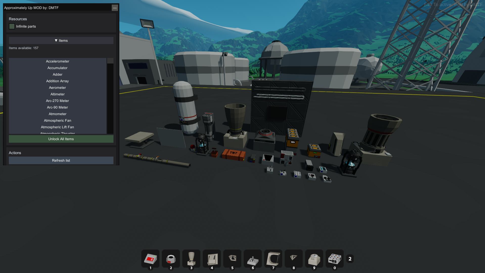
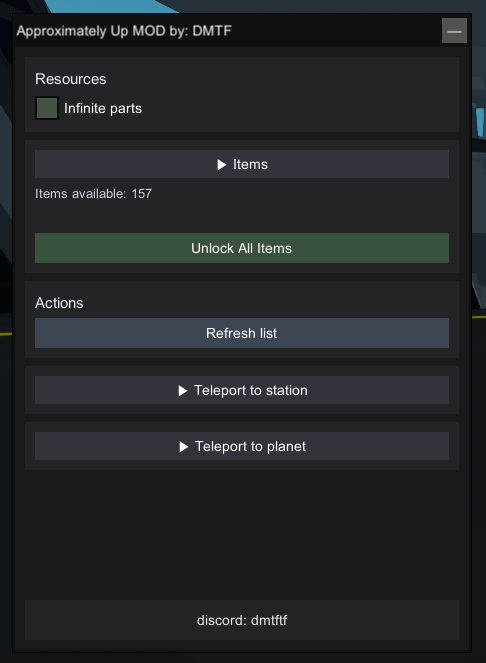

# Approximately Up MOD

status as of March 6: WORKING  
game [version](https://steamdb.info/app/4396220/history/?changeid=34252973)

A simple mod for your game using MelonLoader.

## What this mod does

This mod changes gameplay behavior to add the "Approximately Up" feature.

## Screenshots (In Game)

These screenshots show what the mod adds in the game:





## Requirements

- MelonLoader is required.
- Install (or update) MelonLoader using this [official guide](https://github.com/LavaGang/MelonLoader.Installer/blob/master/README.md#how-to-install-re-install-or-update-melonloader).

## Installation

1. Install MelonLoader first (link above).
2. Open your game folder.
3. Go to the `Mods` folder (create it if it does not exist).
4. Copy the mod `.dll` files into the `Mods` folder.
5. Start the game.

## File Structure Check

These images show how your game files should look after installation:


## Notes

- If the mod does not load, make sure MelonLoader is installed correctly.
- Check game and MelonLoader versions if you have issues.
- If you have any problems, please contact me on discord: `dmtftf`.

## Source Code Build Guide

This section is for developers who want to build the mod from source.

## Dependencies

- Windows + Visual Studio (or Build Tools) with .NET Framework 4.7.2 targeting pack.
- NuGet (for `Lib.Harmony` restore from `packages.config`).
- Local game files from Approximately Up Demo:
- `ApproximatelyUp_Data/Managed` assemblies (for example `Assembly-CSharp.dll`, `UnityEngine*.dll`, `Unity.Entities.dll`, `Unity.Collections.dll`, `Unity.Mathematics.dll`).
- `MelonLoader/net6/MelonLoader.dll` from the game directory.
- `UniverseLib.Mono.dll` file available locally.

## Build From Source

1. Clone this repository.
2. Restore NuGet packages.
3. Build `ApproximatelyUpMOD.csproj` in Release mode.
4. Copy `bin/Release/ApproximatelyUpMOD.dll` into the game `Mods` folder.

Example command:

```powershell
dotnet msbuild .\ApproximatelyUpMOD.csproj /t:Build /p:Configuration=Release /p:GameRootDir="D:\SteamLibrary\steamapps\common\Approximately Up Demo" /p:UniverseLibPath="D:\SteamLibrary\steamapps\common\Approximately Up Demo\Mods\UniverseLib.Mono.dll"
```

`GameRootDir` and `UniverseLibPath` are build properties so you can point to your own local paths.
